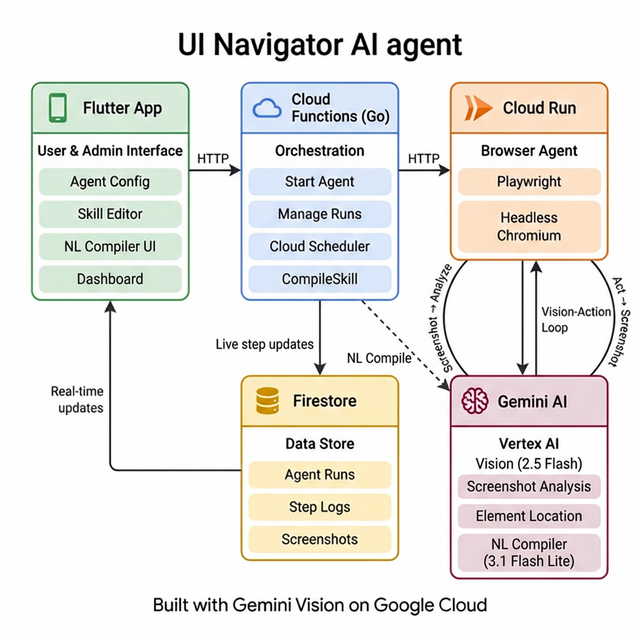
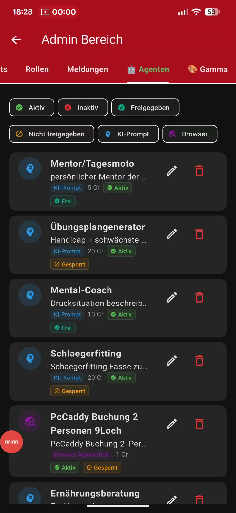
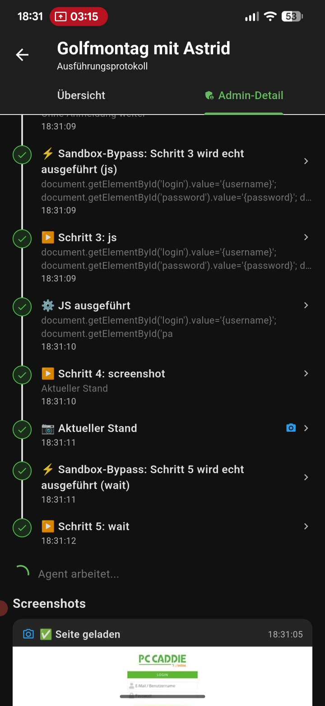
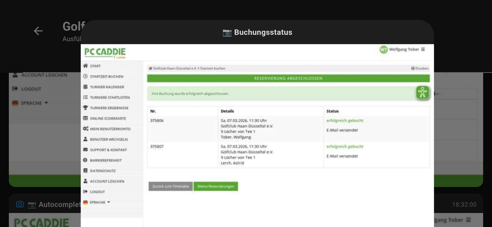

# 🏌️ GolfStatus Browser Agent – Gemini Live Agent Challenge

> **Category:** UI Navigator ☸️ | **Built with:** Gemini Vision + Google Cloud

## 🎯 What It Does

An **autonomous UI Navigator** that navigates complex web interfaces using only visual understanding – no DOM access, no APIs. The agent observes the screen through screenshots, interprets UI elements with **Gemini Vision**, and executes actions to complete multi-step workflows.

### Real-World Use Case: Automated Tee Time Booking

Golf clubs use booking systems like **PC Caddy** where reservations open exactly 6 days in advance at 21:00. Booking a tee time requires 10+ clicks through calendars, time selectors, and forms. Our agent:

1. **Navigates** the booking portal autonomously
2. **Finds** the right date and available time slot
3. **Fills** the reservation form
4. **Can be scheduled** to run at exactly 21:00 when the reservation window opens

> *"You're on the couch. The agent books your Saturday 8am tee time the second it becomes available."*

## 🏗️ Architecture



### Screenshots

| Skill Editor | Agent Running | Booking Confirmed |
|---|---|---|
|  |  |  |

```
┌─────────────────┐     ┌──────────────────────┐     ┌─────────────────┐
│   Flutter App    │────▶│  Cloud Functions (Go) │────▶│  Cloud Run      │
│   (User/Admin)   │     │  Orchestration        │     │  Browser Agent  │
│                  │◀────│                        │◀────│  (Playwright +  │
│  • Agent Config  │     │  • Start/Stop Agent    │     │   Gemini Vision)│
│  • Dashboard     │     │  • Manage Runs         │     │                 │
│  • Skill Editor  │     │  • Firestore Logging   │     │  • Screenshot   │
└─────────────────┘     └──────────────────────┘     │  • Gemini Locate│
                                │                      │  • Click/Input  │
                                ▼                      │  • Vision Loop  │
                        ┌──────────────────┐           └────────┬────────┘
                        │   Firestore       │                    │
                        │  • Agent Runs     │◀───────────────────┘
                        │  • Step Logs      │    (live step updates
                        │  • Screenshots    │     + screenshots)
                        └──────────────────┘
```

### Tech Stack

| Component | Technology | Google Cloud Service |
|---|---|---|
| **Vision AI** | Gemini 2.5 Flash (multimodal) | Vertex AI / GenAI SDK |
| **Browser** | Playwright (headless Chromium) | Cloud Run |
| **Orchestration** | Go Cloud Functions (2nd Gen) | Cloud Functions |
| **Data Store** | Firestore | Firestore |
| **Mobile App** | Flutter (Dart) | Firebase |
| **Scheduling** | Cloud Scheduler | Cloud Scheduler |

## 🔄 How It Works

### The Vision-Action Loop

```
Screenshot → Gemini Vision → Action Decision → Execute → Screenshot → ...
```

1. **Screenshot**: Playwright captures the current browser state
2. **Gemini Vision**: Image is sent to Gemini with a description of what to find
3. **Action**: Gemini returns coordinates (x, y) of the target element
4. **Execute**: Agent clicks, types, or scrolls at the exact position
5. **Repeat** until all steps are complete or a success condition is met

### Skill Definition (DSL)

Admins define skills as a sequence of steps:

```json
[
  {"action": "click", "target": "https://booking.example.com"},
  {"action": "find_click", "target": "first available Saturday tee time"},
  {"action": "input", "target": "Name field", "value": "{player_name}"},
  {"action": "find_click", "target": "Confirm booking button"}
]
```

The `find_click` action is key: it tells Gemini to **visually search** for the best matching element – ideal for finding the first free slot in a calendar grid.

### Sandbox Mode

Every agent run can be executed in **Sandbox mode** – the agent navigates and screenshots everything, but does NOT submit forms or trigger real bookings. Perfect for testing and demos.

## 🚀 Spin-Up Instructions

### Prerequisites

- Google Cloud account with billing enabled
- `gcloud` CLI installed and authenticated
- Docker installed (for local testing)

### 1. Clone & Configure

```bash
git clone https://github.com/WTober/gemini-agent-challenge.git
cd gemini-agent-challenge
```

### 2. Set Environment Variables

```bash
export PROJECT_ID="your-gcp-project-id"
export REGION="europe-west3"
export GEMINI_MODEL="gemini-2.5-flash"
```

### 3. Deploy to Cloud Run

```bash
cd deploy
chmod +x deploy_cloudrun.sh
./deploy_cloudrun.sh
```

### 4. Local Testing (Optional)

```bash
cd browser_agent
docker build -t browser-agent .
docker run -p 8080:8080 \
  -e GCP_PROJECT=$PROJECT_ID \
  -e GEMINI_MODEL=$GEMINI_MODEL \
  browser-agent
```

### 5. Test the Agent

```bash
curl -X POST http://localhost:8080 \
  -H "Content-Type: application/json" \
  -d '{
    "runId": "test-001",
    "agentId": "demo",
    "userId": "demo-user",
    "targetUrl": "https://example-golf-booking.com",
    "inputValues": {"player_name": "John Doe"},
    "actionSequence": [
      {"action": "click", "target": "https://example-golf-booking.com"},
      {"action": "find_click", "target": "booking calendar"}
    ],
    "successCondition": {"type": "visual_verification", "indicator": "Booking confirmed"},
    "dryRun": true
  }'
```

## 📹 Demo Video

See [demo video on Devpost](https://geminiliveagentchallenge.devpost.com/) showing:
1. **Skill Definition** – Admin creates booking steps
2. **Agent Configuration** – Assign skill, set schedule trigger
3. **Sandbox Test** – Admin tests without real booking
4. **User Dashboard** – User views results and screenshots
5. **Live Run** – Agent navigates PC Caddy booking page in real-time

## 👨‍💻 About the Developer

Built by **Wolfgang Tober** – a 70-year-old developer with over **50 years of hands-on coding and architecture experience**.

From **IBM mainframes** to **personal computers** to **mobile apps** – Wolfgang has seen and built it all:
- 🖥️ Mainframe systems (COBOL, assembler)
- 🗄️ Databases across generations (DB2, Oracle, MySQL, PostgreSQL, Firestore, and more)
- 💻 Languages from Fortran to Go, Dart, Python, and Swift
- 📱 Modern mobile development with Flutter (Android + iOS)
- ☁️ Cloud-native architectures on Google Cloud

> *"Age is just a number. The passion for building things never gets old."*

## 📱 The Full GolfStatus App

This Browser Agent is part of **GolfStatus** – a comprehensive AI-powered golf companion app available on **Android** and **iOS**. The full app includes much more:

- 🦔 **Rules Hedgehog (Vision)** – Snap a photo of your ball position, get instant rule guidance
- 📅 **Weekly Briefing** – AI-generated course analysis with weather, tournaments, and availability
- 🦊 **Deal Finder** – Discovers hidden green fee deals and discounts
- ✈️ **Travel Planner** – Complete golf trip planning with hotels and route optimization
- 📰 **News Briefing** – Personalized golf news tailored to your interests
- 💬 **Club Chat** – Community with AI moderation, replies, and photo sharing
- 📊 **Agent Dashboard** – Full dashboard with live step logs and screenshots
- 🎨 **Gamma Presentations** – Agent results as professional in-app presentations

> **Want to try it?** The app is currently in testing. Access can be granted on request.
>
> - 🤖 [Android – Google Play](https://play.google.com/store/apps/details?id=de.wolfgangtober.golfstatus)
> - 🍎 [iOS – TestFlight](https://testflight.apple.com/join/SKzQgswR)

## 🏆 Built for the Gemini Live Agent Challenge

Created for the [Gemini Live Agent Challenge](https://geminiliveagentchallenge.devpost.com/) – `#GeminiLiveAgentChallenge`

**Author:** Wolfgang Tober | **License:** MIT
