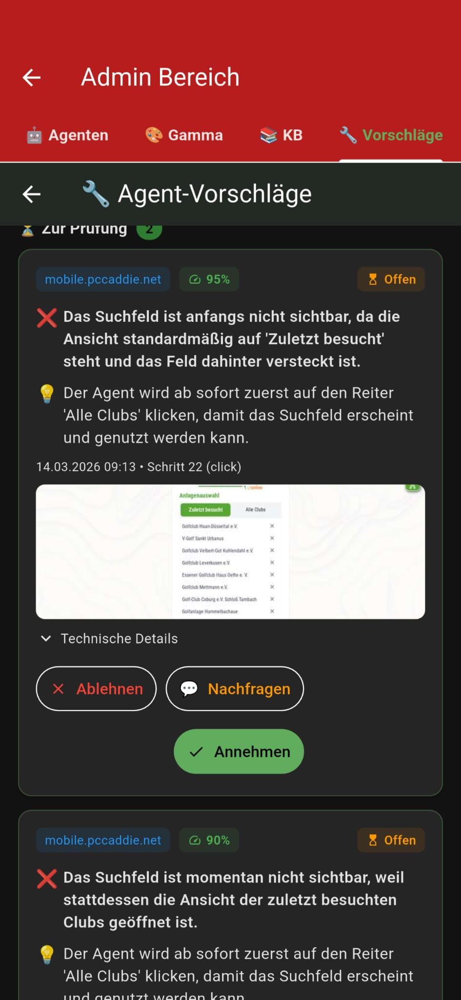
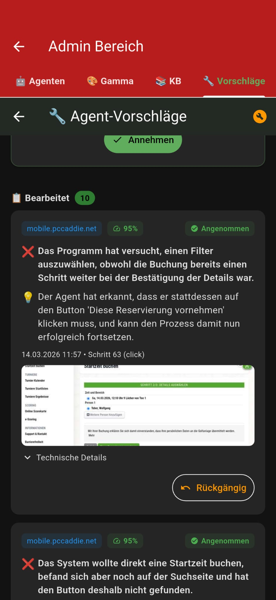
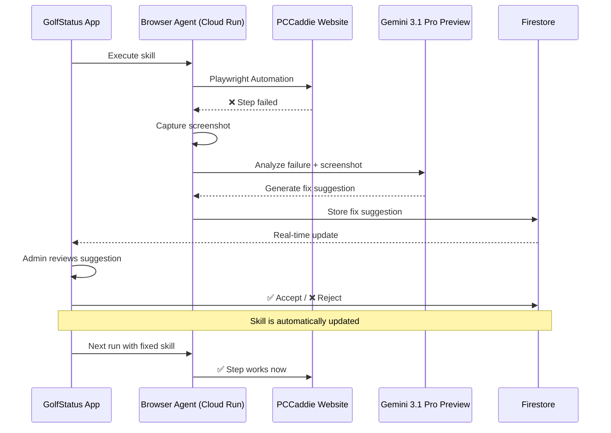
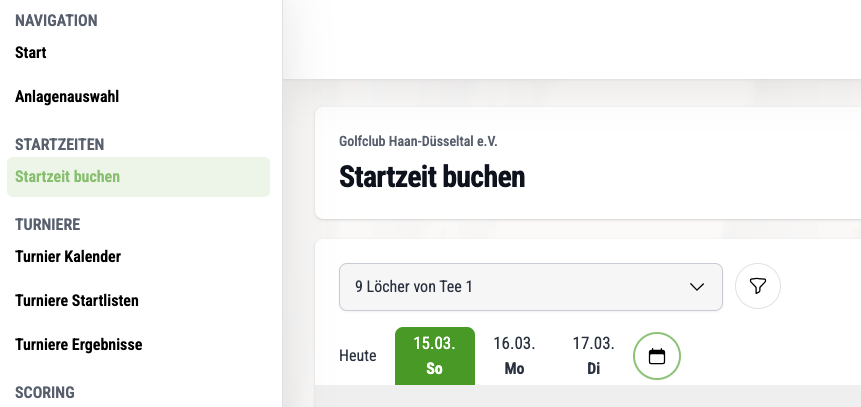
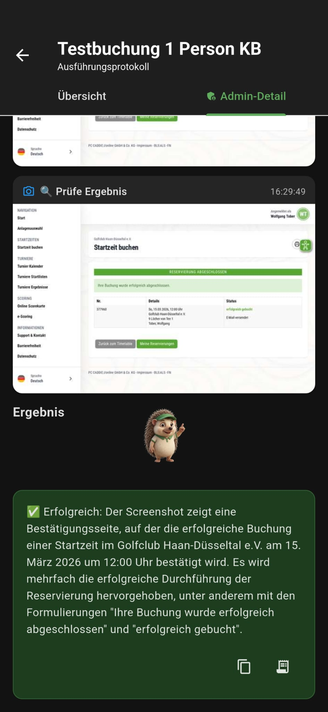
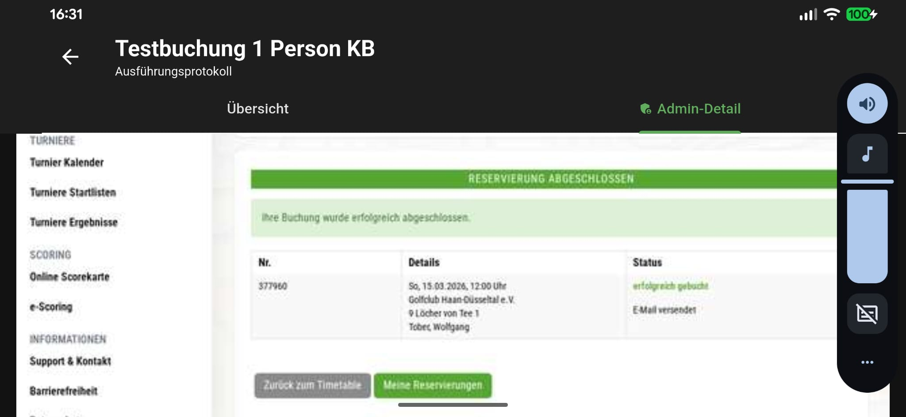
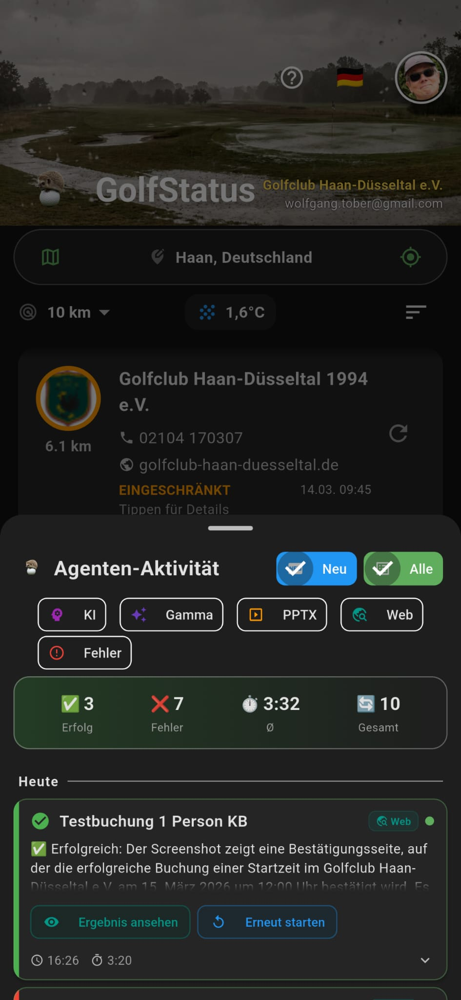

# 🔧 Self-Healing Browser Agent – Live Demo

> **Gemini Agent Challenge** | March 14, 2026 | Project: `golfstatus-a8d6c`

## Summary

The GolfStatus Browser Agent autonomously navigates external golf booking portals (PCCaddie). When the target website changes – new UI elements, updated selectors, removed features – the agent **automatically detects** the failure, captures a screenshot, analyzes it with **Gemini Vision** (`gemini-3.1-pro-preview`, region: global), and generates a concrete fix suggestion.

This document demonstrates **5 consecutive self-healing cycles** from a single live session where the agent iteratively repaired itself to adapt to a completely redesigned website.

### Trigger: PCCaddie UI Modernization

PCCaddie – one of the largest German golf club management software providers – rolled out a **modernized user interface during live operations**. Key changes included:

- **Updated CSS selectors** (e.g., search fields with new IDs)
- **Dropdown menus replaced with button bars** (date selection)
- **Removed UI elements** (slot filter for player count)
- **New navigation** (tab structure for club selection)

The existing browser agent skill was trained on the **old interface** and immediately failed on its first run after the update. The following 5 cycles show how the self-healing loop **progressively adapted the agent to the new interface** – without having to re-record the entire skill.

---

## App Screenshots

| Self-Healing Suggestion (Cycle 1) | Accepted Suggestions (Cycle 5) |
|---|---|
|  |  |

---

## Architecture of the Self-Healing Loop



---

## The 5 Self-Healing Cycles

### Cycle 1: Tab Navigation "Alle Clubs"

| | Detail |
|---|---|
| **Problem** | Agent should click the "Alle Clubs" (All Clubs) tab but clicked a random club instead |
| **Root Cause** | CSS selector was outdated, Vision fallback targeted the wrong element |
| **AI Analysis** | "The search field is not initially visible because the view defaults to 'Recently Visited' and the field is hidden behind it" |
| **Fix** | New step: `click text="Alle Clubs"` using text-based click instead of CSS selector |
| **Method** | Self-Healing Suggestion → Admin Accept ✅ |

**Code Improvement:** Text-based click (Tier 1b) was added as a fallback before Gemini Vision:

```python
# browser_agent/main.py – _vision_click()
# Tier 1b: Try Playwright text-based click (more reliable for text elements)
if not _looks_like_css_selector(target_desc):
    try:
        page.get_by_text(target_desc, exact=True).first.click(timeout=3000)
        return  # Success!
    except Exception:
        pass  # Fall through to Vision
```

---

### Cycle 2: Outdated Search Field Selector

| | Detail |
|---|---|
| **Problem** | `wait_for #pcco-clubselect-search` failed – element no longer exists |
| **Root Cause** | PCCaddie changed the CSS selector of the search field |
| **Fix** | `#pcco-clubselect-search` → `input[placeholder="Search..."]` (3 occurrences in skill) |
| **Method** | In-app fix button 🔧 → direct Firestore correction |

**Innovation:** Temporary admin button in the app that **directly corrects Firestore data**:

```dart
// agents_provider.dart – fixSkillSelectors()
if (td.contains('pcco-clubselect-search')) {
  action['target_description'] = 'input[placeholder="Search..."]';
  fixCount++;
}
```

> The fix button simultaneously corrected the selector at **3 locations** and removed a **duplicate auto-fix step**.

---

### Cycle 3: Click Club Name in Search Results

| | Detail |
|---|---|
| **Problem** | Agent typed "Haan" into search, result appeared, but the club was never clicked |
| **Root Cause** | No step existed to click the club name in the filtered list |
| **AI Analysis** | "The agent suggests first clicking on the golf club name ('Golfclub Haan-Düsseltal e.V.')" |
| **Fix** | New step: `click` on `Golfclub Haan-Düsseltal e.V.` after search input |
| **Method** | Self-Healing Suggestion → Admin Accept ✅ |

> **Result:** Agent now successfully navigates from club search to the booking page!

---

### Cycle 4: Date Selection – Dropdown to Buttons

| | Detail |
|---|---|
| **Problem** | Date selection was changed from a dropdown menu to a **button bar** |
| **Root Cause** | PCCaddie UI redesign: `<select>` → Button row (`Heute | 15.03. | 16.03. | ...`) |
| **Fix** | 1. Removed old `select` step, 2. Click target → `{datum_short}`, 3. Python code auto-derives `datum_short` |
| **Method** | In-app fix button 🔧 + Python code change |

**Intelligent Date Derivation:**

```python
# browser_agent/main.py – Automatic conversion
if "datum" in input_values:
    parts = input_values["datum"].split(".")
    if len(parts) == 3:
        today_short = date.today().strftime("%d.%m.")
        short = f"{parts[0]}.{parts[1]}."
        if short == today_short:
            input_values["datum_short"] = "Heute"  # PCCaddie shows "Heute" (Today) instead of date
        else:
            input_values["datum_short"] = short     # e.g. "15.03."
```

> **Edge Case:** PCCaddie displays `Heute` (Today) instead of `14.03.` for the current day's button label → automatically detected and handled.

**The new PCCaddie Date UI:**



---

### Cycle 5: Slot Filter No Longer Exists

| | Detail |
|---|---|
| **Problem** | Agent tried to select a slot filter (`#pcco-tt-timetable-filter-seat`) that no longer exists |
| **Root Cause** | PCCaddie removed the slot selection from the new interface |
| **AI Analysis** | "The program tried to select a filter even though the booking was already one step ahead at the detail confirmation" |
| **Fix** | Instead of filter → directly click `"Diese Reservierung vornehmen"` (Complete this reservation) |
| **Method** | Self-Healing Suggestion → Admin Accept ✅ |
| **Result** | Agent reaches **Step 3/3: Select Details** – the booking confirmation! 🎉 |

---

## Booking Successfully Completed

After the 5 self-healing cycles, the agent was able to complete the full booking:

| | |
|---|---|
|  |  |



## Results Overview

```
Start: Agent fails at Step 7 (Tab "Alle Clubs")
  ↓ Cycle 1: Self-Healing Fix → Tab navigation repaired
  ↓ Cycle 2: Fix Button → Search field selector updated (3x)
  ↓ Cycle 3: Self-Healing Fix → Club selection added
  ↓ Cycle 4: Fix Button + Code → Date button click implemented
  ↓ Cycle 5: Self-Healing Fix → Missing filter bridged
End: Agent reaches Step 63 → Booking confirmation! ✅
```

### Progress per Cycle:

| Cycle | Method | Steps Reached | Progress |
|---|---|---|---|
| Start | – | 7 of 63 | 11% |
| 1 | Self-Healing | 12 | 19% |
| 2 | Fix Button 🔧 | 25 | 40% |
| 3 | Self-Healing | 40 | 63% |
| 4 | Fix Button + Code | 54 | 86% |
| 5 | Self-Healing | **63** | **100%** ✅ |

---

## Google Cloud Services in the Self-Healing Loop

| Service | Role |
|---|---|
| **Cloud Run** | Browser Agent with Playwright + Gemini Vision |
| **Gemini 3.1 Pro Preview** | Screenshot analysis, fix generation, element localization (region: global) |
| **Cloud Firestore** | Skills, fix suggestions, agent runs (all real-time) |
| **Cloud Functions** | Orchestration, trigger-based workflows |
| **Firebase Auth** | Admin authentication for fix approval |

## Technical Highlights

1. **Multi-Tier Click Strategy**: CSS selector → Playwright text-match → Gemini Vision coordinates
2. **In-App Admin Tools**: Fix suggestions with screenshots, one-click accept/reject
3. **Firestore Fix Button**: Direct skill correction from within the app, no Firebase Console needed
4. **Dynamic Variable `{datum_short}`**: Intelligent date conversion with "Heute" (Today) detection
5. **Idempotent Fixes**: Fix function can be executed any number of times without side effects

## Conclusion

> The Self-Healing Loop proves that an AI agent can **iteratively adapt to changing websites** – with minimal human intervention. Instead of failing completely at the first change, the agent analyzes the error, generates a fix, and progresses further on the next run. **5 cycles, 5 different problems, 100% progress.** 🚀
