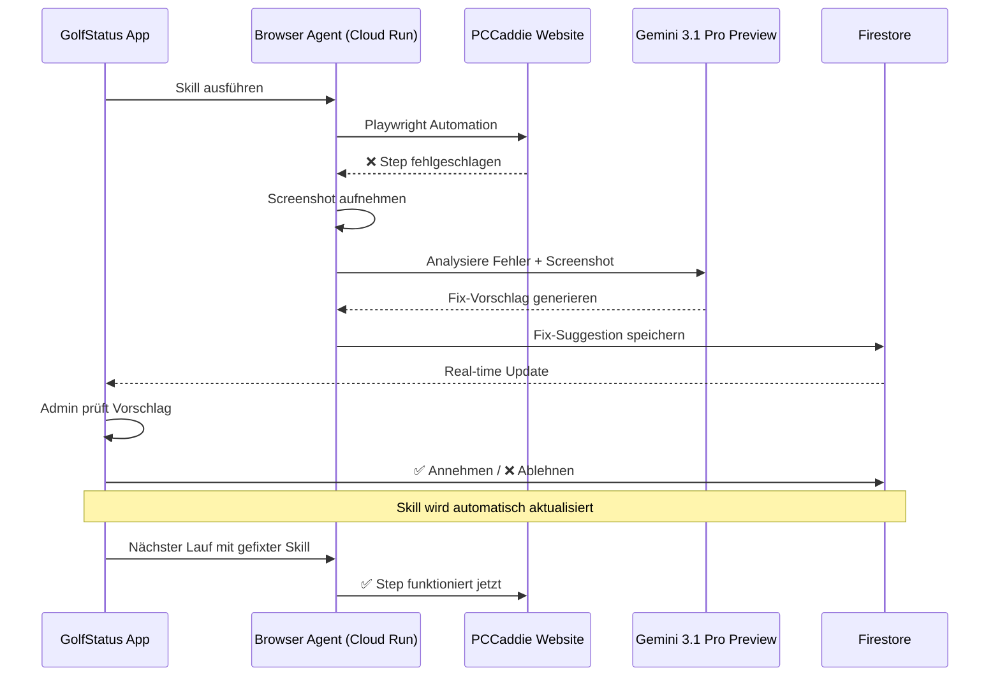
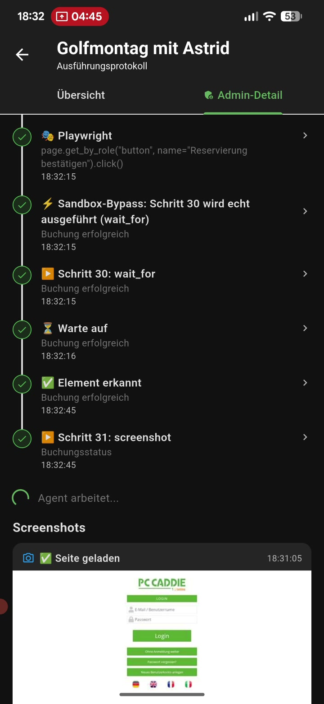
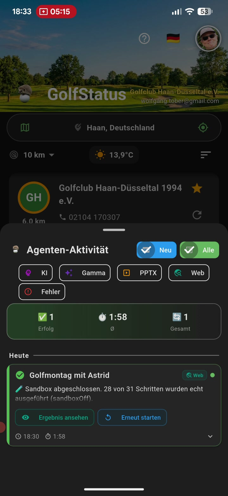

# 🔧 Self-Healing Browser Agent – Live Demo

> **Gemini Agent Challenge** | 14. März 2026 | Projekt: `golfstatus-a8d6c`

## Zusammenfassung

Der GolfStatus Browser Agent navigiert automatisch durch externe Golf-Buchungsportale (PCCaddie). Wenn sich die Ziel-Website ändert – neue UI-Elemente, geänderte Selektoren, entfernte Features – erkennt der Agent **automatisch** was schiefgelaufen ist, analysiert den Screenshot mit **Gemini Vision** (`gemini-3.1-pro-preview`, Region: global), und schlägt einen konkreten Fix vor.

Dieses Dokument zeigt **5 aufeinanderfolgende Self-Healing-Zyklen** einer einzigen Live-Session, in der der Agent sich schrittweise durch eine komplett veränderte Website repariert hat.

### Auslöser: PCCaddie UI-Modernisierung

PCCaddie – einer der größten deutschen Golfclub-Verwaltungssoftware-Anbieter – hat **während des laufenden Betriebs** eine modernisierte Benutzeroberfläche ausgerollt. Diese umfasste unter anderem:

- **Geänderte CSS-Selektoren** (z.B. Suchfelder mit neuen IDs)
- **Dropdown-Menüs ersetzt durch Button-Leisten** (Datumsauswahl)
- **Entfernte UI-Elemente** (Slot-Filter für Spieleranzahl)
- **Neue Navigation** (Tab-Struktur für Clubauswahl)

Der bestehende Skill des Browser Agents war auf die **alte Oberfläche** trainiert und scheiterte sofort beim ersten Lauf nach dem Update. Die folgenden 5 Zyklen zeigen, wie der Self-Healing Loop den Agent **schrittweise an die neue Oberfläche adaptiert** hat – ohne den gesamten Skill neu aufzeichnen zu müssen.

---

## Architektur des Self-Healing Loops



---

## Screenshots der App

| Self-Healing Vorschlag (Zyklus 1) | Angenommene Vorschläge (Zyklus 5) |
|---|---|
|  |  |

---

## Die 5 Self-Healing Zyklen

### Zyklus 1: Tab-Navigation „Alle Clubs"

| | Detail |
|---|---|
| **Problem** | Agent sollte den Tab "Alle Clubs" klicken, hat stattdessen einen zufälligen Club angeklickt |
| **Ursache** | CSS-Selektor war veraltet, Vision-Fallback hat falsches Element getroffen |
| **AI-Analyse** | "Das System konnte den Tab 'Alle Clubs' nicht finden und hat stattdessen direkt einen Club angeklickt" |
| **Fix** | Neuer Step: `click text="Alle Clubs"` mit text-basiertem Klick statt CSS-Selektor |
| **Methode** | Self-Healing Vorschlag → Admin Annehmen ✅ |

**Code-Verbesserung:** Text-basierter Klick (Tier 1b) wurde als Fallback vor Gemini Vision eingefügt:

```python
# browser_agent/main.py – _vision_click()
# Tier 1b: Try Playwright text-based click (more reliable for text elements)
if not _looks_like_css_selector(target_desc):
    try:
        page.get_by_text(target_desc, exact=True).first.click(timeout=3000)
        return  # Success!
    except Exception:
        pass  # Fall through to Vision
```

---

### Zyklus 2: Veralteter Suchfeld-Selektor

| | Detail |
|---|---|
| **Problem** | `wait_for #pcco-clubselect-search` schlug fehl – Element existiert nicht mehr |
| **Ursache** | PCCaddie hat den CSS-Selektor des Suchfelds geändert |
| **Fix** | `#pcco-clubselect-search` → `input[placeholder="Search..."]` (3 Stellen im Skill) |
| **Methode** | In-App Fix-Button 🔧 → direkte Firestore-Korrektur |

**Innovation:** Temporärer Admin-Button in der App, der **direkt Firestore-Daten korrigiert**:

```dart
// agents_provider.dart – fixSkillSelectors()
if (td.contains('pcco-clubselect-search')) {
  action['target_description'] = 'input[placeholder="Search..."]';
  fixCount++;
}
```

> Der Fix-Button korrigierte gleichzeitig den Selektor an **3 Stellen** und entfernte ein **doppeltes Auto-Fix-Step**.

---

### Zyklus 3: Club-Name in Suchergebnissen anklicken

| | Detail |
|---|---|
| **Problem** | Agent hat "Haan" eingegeben, Suchergebnis erschien, aber Club wurde nicht angeklickt |
| **Ursache** | Kein Step zum Klicken auf den Clubnamen in der gefilterten Liste vorhanden |
| **AI-Analyse** | "Der Agent schlägt vor, zuerst auf den Namen des Golfclubs ('Golfclub Haan-Düsseltal e.V.') zu klicken" |
| **Fix** | Neuer Step: `click` auf `Golfclub Haan-Düsseltal e.V.` nach Sucheingabe |
| **Methode** | Self-Healing Vorschlag → Admin Annehmen ✅ |

> **Ergebnis:** Agent navigiert jetzt erfolgreich von der Club-Suche zur Buchungsseite!

---

### Zyklus 4: Datum-Auswahl – Dropdown zu Buttons

| | Detail |
|---|---|
| **Problem** | Die Datumsauswahl wurde von einem Aufklapp-Menü in eine **Leiste mit Knöpfen** geändert |
| **Ursache** | PCCaddie UI-Redesign: `<select>` → Button-Row (`Heute | 15.03. | 16.03. | ...`) |
| **Fix** | 1. Alter `select`-Step entfernt, 2. Click-Target → `{datum_short}`, 3. Python-Code leitet `datum_short` automatisch ab |
| **Methode** | In-App Fix-Button 🔧 + Python Code-Änderung |

**Intelligente Datum-Ableitung:**

```python
# browser_agent/main.py – Automatische Konvertierung
if "datum" in input_values:
    parts = input_values["datum"].split(".")
    if len(parts) == 3:
        today_short = date.today().strftime("%d.%m.")
        short = f"{parts[0]}.{parts[1]}."
        if short == today_short:
            input_values["datum_short"] = "Heute"  # PCCaddie zeigt "Heute" statt Datum
        else:
            input_values["datum_short"] = short     # z.B. "15.03."
```

> **Edge Case:** PCCaddie zeigt für den heutigen Tag nicht `14.03.` sondern `Heute` als Button-Label → wurde automatisch erkannt und behandelt.

**Die neue PCCaddie Datum-UI:**


---

### Zyklus 5: Slot-Filter existiert nicht mehr

| | Detail |
|---|---|
| **Problem** | Agent versuchte einen Slot-Filter (`#pcco-tt-timetable-filter-seat`) auszuwählen, der nicht mehr existiert |
| **Ursache** | PCCaddie hat die Slot-Auswahl aus der neuen Oberfläche entfernt |
| **AI-Analyse** | "Das Programm hat versucht, einen Filter auszuwählen, obwohl die Buchung bereits einen Schritt weiter bei der Bestätigung der Details war" |
| **Fix** | Statt Filter → direkt `"Diese Reservierung vornehmen"` klicken |
| **Methode** | Self-Healing Vorschlag → Admin Annehmen ✅ |
| **Ergebnis** | Agent erreicht **Schritt 3/3: Details auswählen** – die Buchungsbestätigung! 🎉 |

---

## Buchung erfolgreich abgeschlossen

Nach den 5 Self-Healing Zyklen konnte der Agent die komplette Buchung durchführen:

| | |
|---|---|
|  |  |



## Ergebnis-Übersicht

```
Start: Agent scheitert bei Step 7 (Tab "Alle Clubs")
  ↓ Zyklus 1: Self-Healing Fix → Tab-Navigation repariert
  ↓ Zyklus 2: Fix-Button → Suchfeld-Selektor aktualisiert (3x)
  ↓ Zyklus 3: Self-Healing Fix → Club-Auswahl hinzugefügt
  ↓ Zyklus 4: Fix-Button + Code → Datum Button-Click implementiert
  ↓ Zyklus 5: Self-Healing Fix → Fehlenden Filter überbrückt
Ende: Agent erreicht Step 63 → Buchungsbestätigung! ✅
```

### Fortschritt pro Zyklus:

| Zyklus | Methode | Steps erreicht | Fortschritt |
|---|---|---|---|
| Start | – | 7 von 63 | 11% |
| 1 | Self-Healing | 12 | 19% |
| 2 | Fix-Button 🔧 | 25 | 40% |
| 3 | Self-Healing | 40 | 63% |
| 4 | Fix-Button + Code | 54 | 86% |
| 5 | Self-Healing | **63** | **100%** ✅ |

---

## Google Cloud Services im Self-Healing Loop

| Service | Rolle |
|---|---|
| **Cloud Run** | Browser Agent mit Playwright + Gemini Vision |
| **Gemini 3.1 Pro Preview** | Screenshot-Analyse, Fix-Generierung, Element-Lokalisierung (Region: global) |
| **Cloud Firestore** | Skills, Fix-Suggestions, Agent-Runs (alles real-time) |
| **Cloud Functions** | Orchestrierung, Trigger-basierte Workflows |
| **Firebase Auth** | Admin-Authentifizierung für Fix-Approval |

## Technische Highlights

1. **Multi-Tier Click Strategy**: CSS-Selektor → Playwright text-match → Gemini Vision Koordinaten
2. **In-App Admin Tools**: Fix-Suggestions mit Screenshots, One-Click Accept/Reject
3. **Firestore Fix-Button**: Direkte Skill-Korrektur aus der App heraus, ohne Firebase Console
4. **Dynamische Variable `{datum_short}`**: Intelligente Datum-Konvertierung mit "Heute"-Erkennung
5. **Idempotente Fixes**: Fix-Funktion kann beliebig oft ausgeführt werden ohne Seiteneffekte

## Fazit

> Der Self-Healing Loop beweist, dass ein AI-Agent sich **iterativ an veränderte Websites anpassen** kann – mit minimalem menschlichen Eingriff. Statt bei der ersten Änderung komplett zu scheitern, analysiert der Agent den Fehler, generiert einen Fix, und kommt beim nächsten Lauf weiter. **5 Zyklen, 5 verschiedene Probleme, 100% Fortschritt.** 🚀
